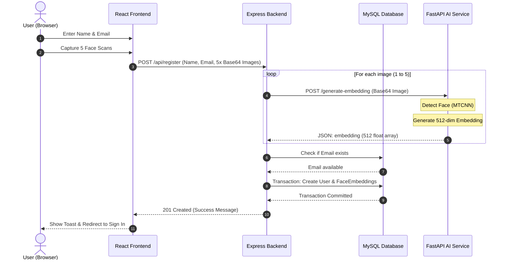
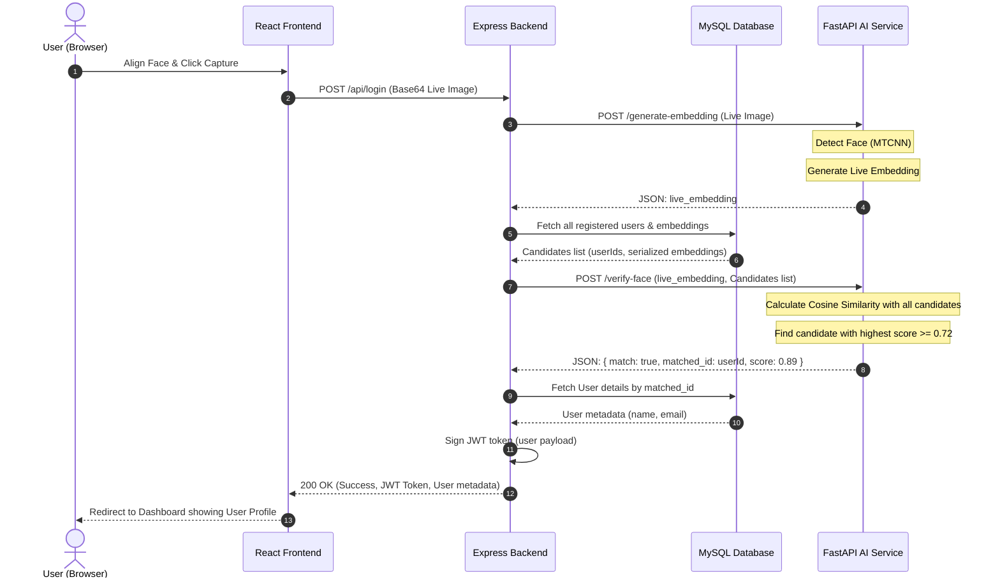

# Sequence Diagrams

Below are the sequence flows for registration and login operations.

## 1. Face Registration Flow

```mermaid
sequenceDiagram
    autonumber
    actor User as User (Browser)
    participant Front as React Frontend
    participant Back as Express Backend
    participant DB as MySQL Database
    participant AI as FastAPI AI Service

    User->>Front: Enter Name & Email
    User->>Front: Capture 5 Face Scans
    Front->>Back: POST /api/register (Name, Email, 5x Base64 Images)
    
    loop For each image (1 to 5)
        Back->>AI: POST /generate-embedding (Base64 Image)
        Note over AI: Detect Face (MTCNN)
        Note over AI: Generate 512-dim Embedding
        AI-->>Back: JSON: embedding (512 float array)
    end

    Back->>DB: Check if Email exists
    DB-->>Back: Email available
    
    Back->>DB: Transaction: Create User & FaceEmbeddings
    DB-->>Back: Transaction Committed
    
    Back-->>Front: 201 Created (Success Message)
    Front-->>User: Show Toast & Redirect to Sign In
```

---

## 2. Face Login Flow (1:N Matching)

```mermaid
sequenceDiagram
    autonumber
    actor User as User (Browser)
    participant Front as React Frontend
    participant Back as Express Backend
    participant DB as MySQL Database
    participant AI as FastAPI AI Service

    User->>Front: Align Face & Click Capture
    Front->>Back: POST /api/login (Base64 Live Image)
    
    Back->>AI: POST /generate-embedding (Live Image)
    Note over AI: Detect Face (MTCNN)
    Note over AI: Generate Live Embedding
    AI-->>Back: JSON: live_embedding

    Back->>DB: Fetch all registered users & embeddings
    DB-->>Back: Candidates list (userIds, serialized embeddings)
    
    Back->>AI: POST /verify-face (live_embedding, Candidates list)
    Note over AI: Calculate Cosine Similarity with all candidates
    Note over AI: Find candidate with highest score >= 0.72
    AI-->>Back: JSON: { match: true, matched_id: userId, score: 0.89 }
    
    Back->>DB: Fetch User details by matched_id
    DB-->>Back: User metadata (name, email)
    
    Back->>Back: Sign JWT token (user payload)
    Back-->>Front: 200 OK (Success, JWT Token, User metadata)
    Front-->>User: Redirect to Dashboard showing User Profile
```
